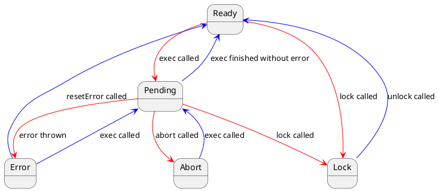

import { Aside } from '@astrojs/starlight/components';

**Во @vue-modeler/model действие — это объект**, который хранит операцию для изменения состояния модели, имеет методы управления выполнением и свойства для контроля состояния выполнения. 
- действие объявляется метод класса модели с декоратором @action. Метод асинхронный, не возвращает данных;
- метод преобразуется в действие при создании модели;
- действие принадлежит модели, в которой объявлено;
- сохраняет контекст модели, используйте где угодно без потери контекста;

Такой подход дает ряд преимуществ:
- статус выполнения доступен для отслеживания без написания шаблонного кода 
- отмена, блокировка, разблокировка доступны как методы - не нужно изобретать "велосипед" 
- работа с действиями и обработка ошибок  единообразна и предсказуема  
- код бизнес-логики содержит только логику изменения состояния модели
- объем кода  меньше в  разы по сравнению с другими подходами


Вот наглядный пример.

**Без действий (шаблонный код):**
```typescript
export const useCart = defineStore('cart', () => {
  const items = shallowRef<Product[]>([])
  // Флаги выполнения операции
  const isAddingProduct = ref(false)
  const addError = ref<Error | null>(null)

  async addProduct(product: Product): Promise<void> {
    // Проверяем, что операция не выполняется
    if (this.isAddingProduct.value) return
    // Устанавливаем флаг выполнения операции
    this.isAddingProduct.value = true
    // Сбрасываем ошибку
    this.addError.value = null
    // Выполняем операцию
    try {
      await api.addToCart(product)
      // Сохраняем новое состояние в модели
      this.items = [...this.items, product]
    } catch (error) {s
      // Сохраняем ошибку
      this.addError.value = error
      // Пробрасываем ошибку дальше
      throw error
    } finally {
      // Сбрасываем флаг выполнения операции
      this.isAddingProduct.value = false
    }
  }

  return {
    items,
    isAddingProduct,
    addError,
    addProduct
  }
})

const cart = useCart()
await cart.addProduct(newProduct)

watch(cart.isAddingProduct, (value) => {
  console.log('isAddingProduct', value)
})

watch(cart.addError, (value) => {
  console.log('addError', value)
})
```

Давайте немного разберемся, что мы видим в коде.

Разработчик пишет шаблонный код для каждой операции изменения состояния: 
1. Устанавливает флаг выполнения операции 
2. Готовит данные для сохранения
3. Сохраняет новое состояние в хранилище 
4. Если сохранение:
    1. **успешно** - коммитит новое состояние в модель
    2. **не успешно** - устанавливает флаг ошибки, ошибка сохраняется или  прокидывается дальше
5. Удаляет флаг выполнения операции

Есть особые случаи:
- Нужно следить, что бы операция не была вызвана, пока не завершился предыдущий вызов, иначе может быть неконсистентное состояние.
- Случается, что операцию нужно отменить или заблокировать.

Это тоже шаблонный код, но разработчики по разному обрабатывают эти случаи. 
Такой код сложно поддерживать и тестировать.

Действие-объект берет на себя всё, включая особые случаи. Позволяет разработчику сконцентрироваться на бизнес-логике (п. 2, 3, 4.1), избавляет от когнитивной нагрузки. Код всех операций стандартизирован и не нужно изобретать велосипед.

**Тоже самое, но с действиями:**
```typescript
class Cart extends ProtoModel {
    ...

    @action async addProduct(product: Product): Promise<void> {
        // Отправляем данные на серверы
        await this.apiService.addToCart(product);
        // Сохраняем данные в модели
        this._items.push(product);
    }
}

const useCart = provider(() => Cart.model(apiService));
const cart = Cart.model(apiService);

await cart.addProduct.exec(newProduct);

watch(cart.addProduct.isPending, (value) => {
  console.log('isPending', value)
})

watch(cart.addProduct.error, (value) => {
  console.log('error', value)
})
```

## Методы

| Метод | Аргументы | Описание |
|----------|----------|-----------|
| `exec` | `...args: Args` | Выполнить действие |
| `abort` | `reason?: unknown` | Отменить действие |
| `lock` | `void` | Заблокировать действие |
| `unlock` | `void` | Разблокировать действие |
| `resetError` | `void` | Сбросить ошибку |

Только `exec` имеет аргументы. TypeScript вычисляет его сигнатуру на основе метода действия, поэтому проверки типов аргументов будут работать.

## Свойства

### Свойства состояния 
Свойства отражают состояние выполнения операции. Всего 5 состояний, для каждого из них определено свойство:

| Свойство | Тип | Описание |
|----------|-----|-----------|
| `isReady` | `boolean` | Действие готово к выполнению |
| `isPending` | `boolean` | Действие выполняется |
| `isAbort` | `boolean` | Действие отменено |
| `isLock` | `boolean` | Действие заблокировано |
| `error` | `null \| ActionError` | Ошибка выполнения |

Свойства реактивны, поэтому можно использовать их в шаблонах, в computed свойствах и в watch.

**Матрица состояний:**

| Состояние | Ready | Pending | Error | Abort | Lock |
|-----------|-------|---------|--------|------|------|
| **Ready ->**     | ❌    | ✅      | ❌     | ❌   | ✅   |
| **Pending ->**   | ✅    | ❌      | ✅     | ✅   | ✅   |
| **Error ->**     | ❌    | ✅      | ❌     | ❌   | ✅   |
| **Abort ->**     | ❌    | ✅      | ❌     | ❌   | ❌   |
| **Lock ->**      | ✅    | ❌      | ❌     | ❌   | ❌   |

Переходы между состояниями строго определены.
Попытка выполнить действие в неверном состоянии приведет к ошибке.

### Диаграмма состояний



### Свойства контекста состояния

Эти свойства предоставляют дополнительную информацию о текущем состоянии действия.

| Свойство  | Тип | Описание | Кто отвечает за изменения |
|-----------|-----|-----------|-----------|
| abortController | `AbortController \| null` | `AbortController` текущей операции | метод `exec` устанавливает при запуске, обнуляет при завершении |
| args | `Args \| never[]` | массив аргументов текущей или последней операции | метод `exec` устанавливает при запуске |
| promise | `Promise<void> \| null` | `Promise` текущей  | метод `exec` устанавливает при запуске, обнуляет при завершении |
| abortReason | `unknown \| null` | причина отмены | метод `abort` устанавливает при отмене |
 
 


## Как использовать действия

Разберем на примере добавления товара в корзину.

```javascript
// Определяем класс модели.
//  Не забываем унаследоваться от ProtoModel. Это обязательно.
class CartModel extends ProtoModel {
    ...

    // Декоратор @action указывает, что это будет действие.
    @action async addProduct(product: Product): Promise<void> {
        // Отправляем данные на серверы
        await this.apiService.addToCart(product);
        // Сохраняем данные в модели
        this._items.push(product);
    }
}


// В комВыполняем действие
cartModel.addProduct.exec(newProduct);

// Следим за статусом выполнения операции
watch(
  cartModel.addProduct.isPending,
  console.log
)
// Следим за ошибками
watch(
  cartModel.addProduct.error,
  console.log
)
```

### Объявляем

Просто добавляем `@action` к асинхронному методу, который не возвращает данных.

```typescript
// Определяем класс модели. Не забываем унаследоваться от ProtoModel.
class CartModel extends ProtoModel {
    ...
    @action async addProduct(product: Product): Promise<void> {
        // Отправляем данные на серверы
        await this.apiService.addToCart(product);
        // Сохраняем данные в модели
        this._items.push(product);
    }
}
```

Обязательные условия:
- Класс должен наследоваться от `ProtoModel`.
- Метод должен возвращать `Promise<void>`.
- Метод должен быть декорирован декоратором `@action`.

### Получаем как объект

**После создания модели действие - это своиство модели и объект.** Для получения действия используйте имя метода, которое было объявлено как действие. TypeScript корректно определяет типы, поэтому автодополнение свойств и методов для действия будет работать.

```typescript
// ✅ Правильно - используем .exec()
await cartModel.addProduct.exec(productId);

// ❌ Неправильно - TypeScript будет ругаться
await cartModel.addProduct(productId);
```

**Внутри класса модели TypeScript видит действие как метод,** но - это объект.  Что бы получить доступ к свойствам и методам действия и избежать ошибок типов TypeScript нужно получить действие через метод `this.action(this.addProduct)`. Он вернет действие с правильными типами и проблем с TypeScript не будет. Теперь действие можно использовать так же, как и в внешнем контексте: выполнять, следить за состоянием и т.п.

```typescript
// ❌ Неправильно. Для TypeScript this.addProduct - это метод,
//  и у него нет свойств
const error = this.addProduct.error;

// ✅ Правильно - получаем действие как объект, и у него есть свойства
const error = this.action(this.addProduct).error;
```

Действия-объект сохраняет контекст модели. Можно безопасно сохранять в переменную и использовать её в других местах.

```typescript

const addProductAction = cart.addProduct;
await addProductAction.exec(productId);

watch(addProductAction.isPending, (value) => {
  console.log('isPending', value)
})

watch(addProductAction.error, (value) => {
  console.log('error', value)
})
```

### Выполняем 

**Во внешнем контексте** получаем действие-объект через свойство модели и вызываем метод `exec(...)`.
`exec(...)` копирует сигнатуру исходного метода, поэтому проверки типов будут работать.

```typescript
// ✅ Правильно - используем .exec()
await cartModel.addProduct.exec(productId);

// ❌ Неправильно - TypeScript будет ругаться, потому что здесь действие уже объект
await cartModel.addProduct(productId);
```

**Внутри класса модели** есть 2 способа выполнить действие:
1. аналогично внешнему контексту: получить как объект через `this.action(this.addProduct)` и вызвать метод `exec(...)`.
2. вызвать действие как метод модели: `this.addProduct(newProduct)`. Это возможно, потому что TS "видит" действие как метод внутри класса.


```typescript
// ❌ Неправильно. Внутри класса так не работает,
// потому что TypeScript видит действие как метод,
// а не как объект.
await this.addProduct.exec(productId);

// ✅ Правильно: получаем как объект,
await this.action(this.addProduct).exec(productId);

// ✅ Так тоже можно, если нужно проверить состояние
const addProductAction = this.action(this.addProduct);
await addProductAction.exec(productId);
if (addProductAction.error) {
  // Обрабатываем ошибку
}

// ✅ Правильно: вызываем действие как метод модели
await this.addProduct(productId);
```

<Aside type="caution">
**Вызов как метода != вызов метода.** Декоратор `@action` подменяет оригинальный метод и "под капотом" получает действие как объект и вызывает метод `exec(...)`. try...catch не будет работать, как ожидается. См. [Обработка ошибок](/guides/actions/#обрабатываем-ошибки).
</Aside>

Действие асинхронное, поэтому `exec(...)` всегда возвращает `Promise<void>`. Вы не получите  данные, даже если попробуете их вернуть. Это сделано осознанно, потому что действие должно менять состояние модели, а не возвращать данные.

### Следим за состоянием 

Внутри UI компонент можно использовать всё стандартные средства наблюдения за реактивными переменными: watch, watchEffect, computed.
```vue

<template>
  <div>
    <p>isPending: {{ cartModel.addProduct.isPending }}</p>
    <p>error: {{ error.message }}</p>
  </div>
</template>

<script setup>
const cartModel = useCartModel()
watch(
  cartModel.addProduct.isPending,
  console.log
)


const error = computed(() => cartModel.addProduct.error?.cause ?? cartModel.delProduct.error?.cause )
</script>
```

Внутри класса модели нужно использовать только `this.watch` и  `this.computed`.
Эти методы доступны во всех моделях.

Если нужно наблюдать за собственным действием, его нужно получить как объект.

```typescript
class CartModel extends ProtoModel {
  ...
  constructor () {
    super()
    this.watch(
      () => this.action(this.addProduct).isPending,
      (value) => console.log('addProduct isPending', value)
    )
  }

  @action async addProduct(product: Product): Promise<void> {
    ...
  }
}
```
Если действие принадлежит другой модели, то его действие уже объект, можно обращаться по имени метода.

```typescript
class CartModel extends ProtoModel {
  ...
  constructor (
    readonly user: Model<User>
  ) {
    super()
    this.watch(
      () => this.user.login.isPending,
      (isPending) => console.log('user login isPending', isPending)
    )
  }
}
```


### Обрабатываем ошибки 

Любое действие может завершиться с ошибкой. Их можно разделить на 3 группы: 
- **Исключения** возникают в бизнес-логике или слое инфраструктуры: валидация данных, авторизации, нехватки товара, любой не успешный ответ от сервера или БД.
- **Системные ошибки** выбрасываются самим интерпретатором JS: RangeError, ReferenceError, SyntaxError, TypeError, URIError, EvalError. 
- **Внутренние ошибки** выбрасываются внутри библиотеки при нарушении логики работы действия или попытке выполнить действие в неверном состоянии.

Системные и внутренние ошибки  не должны возникать, должны быть отловлены при разработке. Они не перехватываются, приводят к падению приложения и попадают в консоль.

Исключения должны быть обработаны и отображены пользователю в каком-то виде.

Метод `exec(...)` перехватывает только исключения, оборачивает их в `ActionError` и сохраняет в свойстве `error` для обработки. Свойство `error` доступно только для чтения и реактивно. Повторный запуск действия сбросит ошибку.
`ActionError` обеспечивает единообразный интерфейс для обработки.

```typescript
class CartModel extends ProtoModel {
  ...

  @action async addProduct(product: Product): Promise<void> {
    // это будет перехвачена 
    throw new Error('Product not found')

    // здесь тоже будет перехвачено, если там ошибка 
    await this.apiService.addProduct(product)
  }
}
```

Так как `exec` перехватывает исключения, то try...catch не работает. Проверяйте свойство `error` после выполнения действия.

```typescript
try {
  // ❌ это не работает.
  // exec перехватит исключение,
  // сохранит в error,
  // завершит выполнение как обычно.
  await action.exec()
} catch (error) {
  // ❌ сюда никогда не попадем.
  console.error('Error:', error.message)
}


// ✅ это работает. 
await action.exec()
// ✅ проверяем свойство error.
if (action.error?.cause instanceof HttpError) {
  console.error('HTTP error:', action.error.cause.message)
}
if (action.error?.cause instanceof BusinessError) {
  console.error('Business error:', action.error.cause.message)
}
```

Действия могут вызывать друг друга. Если в дочернем действии возникла ошибка, она там и останется, потому что перехвачена в `exec`. Родительское действие продолжит выполнение, как-будто ошибки не было. Что бы прервать выполнение  нужно прокинуть ошибку в родительское действие. Это можно сделать методом `ActionError.throwCause()` без дополнительных проверок.

```typescript

class ChildModel extends ProtoModel {
  ...
  @action async childAction(): Promise<void> {
    throw new Error('Child error')
  }
}

class ParentModel extends ProtoModel {
  constructor (
    readonly child: Model<ChildModel>
  ) {
    super()
  }

  @action async parentAction(): Promise<void> {
    await this.child.childAction.exec()
    // пробрасываем ошибку в родительское действие
    this.child.childAction.error?.throwCause()
    // или так, но больше кода. Лучше использовать throwCause().
    if (this.child.childAction.error) {
      throw this.child.childAction.error.cause
    }
  }
}
```

Если нужно, что бы `exec` не перехватывал ошибку, то можно:
1. создать свой класс ошибок,
2. унаследовать от  `ActionInternalError`,
3. оборачивать ошибки в него и кидать дальше.

Для таких ошибок работает стандартный try...catch процесс.
Но так лучше не делать.

Используйте прихват в `exec` и свойство `error`, этого достаточно для большинства случаев.

<Aside type="note">
- `exec` перехватывает только исключения, try...catch не работает.
- проверяйте свойство `error` после выполнения действия.
- для проброса ошибки дальше используйте метод `throwCause()`.
</Aside>

### Отмена выполнения

Для отмены есть метод `abort()`. Процесс отмены построен на `AbortController`. 

Что бы `abort` работал, есть обязательные условия: 
1. при объявлении действия, последний аргумент метода, должен иметь тип `AbortController`
2. аргумент должен быть опциональным, что бы TypeScript не требовал его явного указания при вызове `exec`
3. код внутри действия должен использовать переданный  `AbortController`, иначе отменить операцию не получиться.

Работает это так:
1. **метод `exec`** 
    - создает `AbortController`, если он не передан явно, или использует тот что передали 
    - сохраняет его как состояние на время выполнения действия
    - передает `AbortController` в исходный метод, всегда в последнем аргументе
3. **исходный метод** 
    - использует этот `AbortController` в запросах и других операциях
4. **метод `abort`** 
    - вызывает метод `abort` на сохраненном `AbortController`, это провоцирует выбрасывание исключения 
5. **метод `exec`**
    - перехватывает это исключение,
    - убеждается что это исключение отмены,
    - переводит действие в состояние `abort`, сохраняет причину отмены в свойстве `abortReason`
    - завершается успешно, но действие в состоянии `abort` и не возвращает данных


```typescript
class CartModel extends ProtoModel {
  ...
  @action async addProduct(
    product: Product,
    abortController = new AbortController(), // ✅ Правильно
  ): Promise<void> {
    await this.apiService.addProduct(product, abortController) // ✅ Правильно
  }

  // ❌ для этого действия abort() не работает, потому что не использует переданный AbortController
  @action async deleteProduct(productId: number): Promise<void> {
    const abortController = new AbortController() // ❌ Неправильно
    await this.apiService.deleteProduct(product, abortController) // ❌ Неправильно
  }
}

const cartModel = new CartModel()
const cartModel.addProduct.exec(product)

// Отменяем операцию
abortController.abort()
```

Бывают случаи, когда одно действие вызывает другое, и может быть отменено согласно бизнес логике. Тогда дочернее действие тоже должно быть отменено автоматически.

Что бы это работало, необходимо чтобы:
1. дочернее действие поддерживало `AbortController`,
2. `AbortController` был общим, его нужно явно передать в дочернее действие последним аргументом.

```typescript

class SomeModel extends ProtoModel {

  @action childAction(abortController?: AbortController ): Promise<void> {
    ...
  }
  
  @action parentAction(abortController?: AbortController ): Promise<void> {
    // ✅ Правильно. Предаем abortController дальше, он общий 
    await this.action(this.childAction).exec(abortController)
  }
}
```

## Следующие шаги

Здесь мы рассмотрели основы работы с действиями. Они покрывают большинство случаев использования. В следующих разделах мы рассмотрим более сложные сценарии и примеры использования.

Теперь, когда вы изучили действия, вы можете:
1. [Изучить состояния подробнее](/guides/states/)
2. [Познакомиться с декораторами](/guides/decorators/)
3. [Изучить обработку ошибок](/guides/error-handling/)
4. [Посмотреть примеры](/examples/) 
